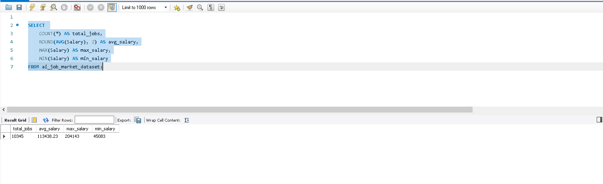
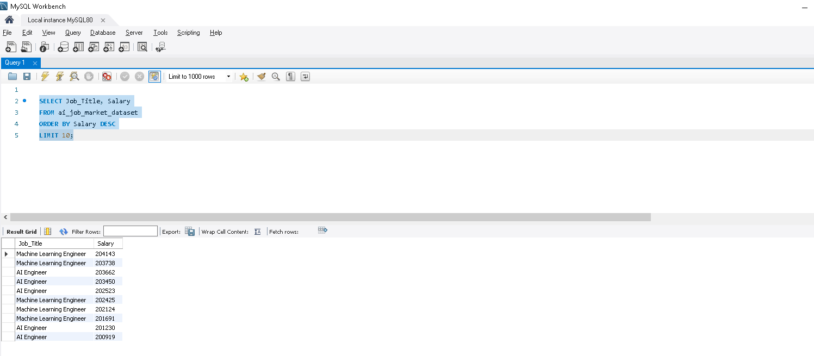
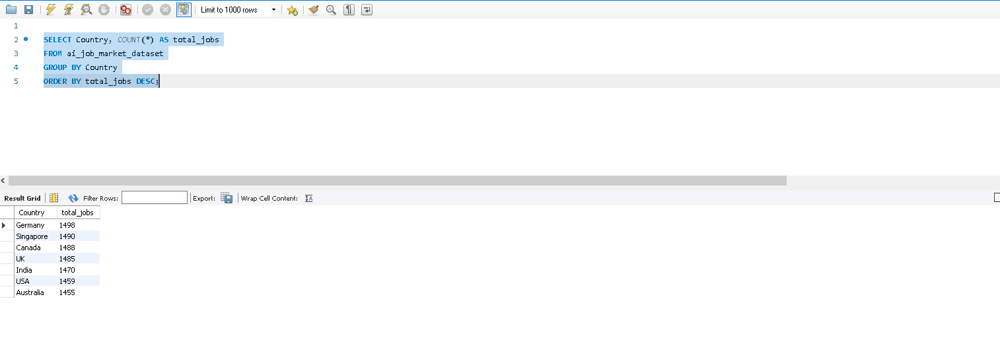
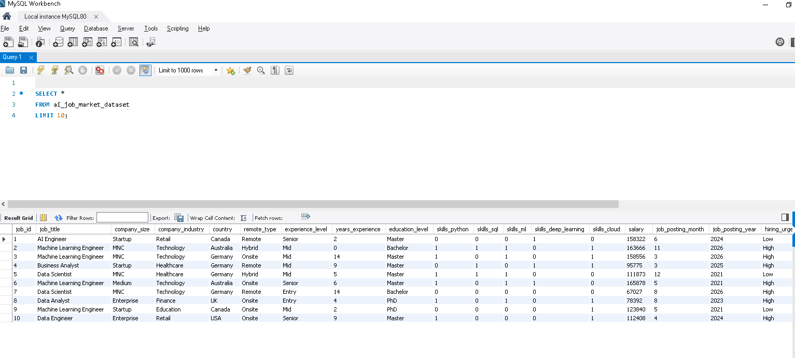
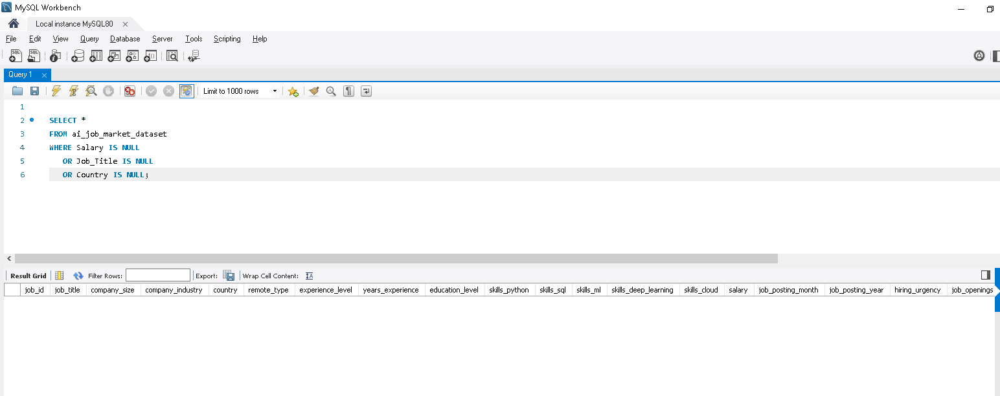

# AI Job Market SQL Analysis

## 📊 Overview
This project analyzes AI job market data using SQL to extract insights about salaries, demand, and global trends.

---

## 📌 Key Insights

### KPI Dashboard

### Top Paying Jobs

### Job Demand by Country

### Data Understanding

### Data Quality Check

---

## 🧠 Analysis Sections
- Data Understanding
- Data Quality Check
- Core Analysis
- KPI Metrics
- Advanced Insights

---

## 🛠 Tools Used
- SQL (MySQL / PostgreSQL)
- GitHub for version control
